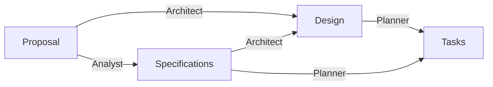

# Agentic Software Engineering Workshop

## Overview

This directory contains the following files:

- `compose.yaml` - Docker Compose file to launch OpenCode container. Inspect it before launching the container.
- `opencode.jsonc` - OpenCode configuration file. Update it as needed, especially to add your specific provider and model configurations. Also see [OpenCode config documentation](https://opencode.ai/docs/config/).
- `agents/` - Agent definitions and permissions. See [OpenCode agents documentation](https://opencode.ai/docs/agents/).
- `workspace/` - A directory containing sample project artifacts based on [a previously vibe-coded project](https://github.com/aadityabhatia/usma-class-timer). See README.md and proposal.md for more details. Replace them if you have another project in mind.

> [!TIP]
> Ask your friends with self-hosted LLMs for their configuration files.

## Getting Started

1. On Windows, Install WSL, Docker, and git.

Verify that you have WSL 2. Run `wsl` in PowerShell as an admin to confirm.

```sh
wsl --version # verify; if not present, type `wsl` to install and then reboot as needed
```

Install Git and Docker.

```sh
winget install Git.Git Docker.DockerCLI # install git and docker
```

On any other OS, just ensure you have git and Docker available.

2. Clone this repository. Update the contents as needed.

```sh
git clone ...
cd ...
```

3. Launch OpenCode container: `docker compose up -d`

To stop a running container, run `docker compose down --remove-orphans`. Check container status by running `docker compose ps` in the same directory or `docker ps` anywhere.

4. Open http://localhost:4096 in your browser

5. Under OpenCode Settings
    - `Show Reasoning Summaries`
    - `Expand shell tool parts`
    - Advanced > `Show agent`
    - Add providers if you have API keys available

6. Add the project folder `/workspace` to your OpenCode instance

7. Create a new session and start interacting with various agents. Select your preferred model. Add providers and models as needed. Some agents have more permissions than others. See [OpenCode permissions documentation](https://opencode.ai/docs/permissions/).

See [OpenCode documentation](https://opencode.ai/docs/) for more details.

## Proposed Agentic Workflow



### Artifacts

- Proposal describes the problem, scope, and user intent. It answers the why and what.
- Specifications include functional and non-functional requirements, constraints, and risks. It answers the what and how.
- Design describes the system architecture, data flow, interfaces, and dependencies. It answers the how.
- Tasks are a concrete, ordered implementation checklist -- backlog of work items with clear completion criteria.

### Agents

- Analyst: Translate user intent and proposal into a clearly defined set of specifications including functional and non-functional requirements, constraints, and risks
- Architect: Convert proposal and specifications into a workable technical design
- Planner: Convert design and specifications into an executable implementation plan
- Technical Manager: oversee project execution; chunk
- Developer: Implement code, run commands, write unit tests, run lint/typecheck, investigate errors, and debug
- Reviewer: Review correctness, clarity, maintainability, and requirement alignment
- Tester: Design and execute unit, integration and end-to-end tests; validate test quality and coverage of required behavior

## References

- [OpenCode](https://opencode.ai/)
- [github.com/aadityabhatia/agents-opencode](https://github.com/aadityabhatia/agents-opencode)
- [Mistral Small 4 / Medium 3.5](https://docs.mistral.ai/models/overview)
- [Poolside Laguna XS 2.1](https://poolside.ai/blog/introducing-laguna-xs-2-1)
